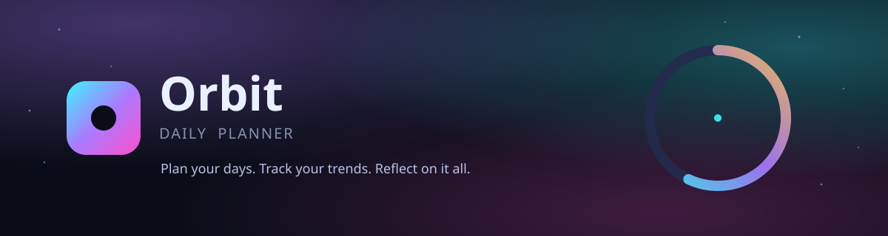

<div align="center">



<br>

[](https://nodejs.org)
[](https://expressjs.com)
[](https://www.mysql.com)
[](https://developer.mozilla.org/en-US/docs/Web/JavaScript)
[](#-personal-use-only)

</div>

<br>

> Orbit Planner is an application to plan, manage, and observe the trend of day-to-day activities. This application is heavily personalized for Ben3zy's needs and should be used only by Ben3zy and not anybody else.

<br>

## ✨ What's inside

Orbit is a private, single-user productivity app built around three views — a live dashboard, a daily planner, and a reflective journal — wrapped in a neon glassmorphism interface with an animated wireframe-brain login screen.

<table>
<tr>
<td width="33%" valign="top">

### 📊 Dashboard
Today's blocks at a glance, an activity breakdown pie chart (Daily / Weekly / Monthly), a weekly planned-vs-completed bar chart, and a monthly completion-rate trend line.

</td>
<td width="33%" valign="top">

### 📝 Create Planner
Add time-boxed activities with custom categories, edit or delete any block, browse the past 7 days, and let older entries roll off automatically.

</td>
<td width="33%" valign="top">

### 📔 Journal
Daily mood + free-form reflection, custom tags, and a searchable history of every past entry with inline edit/delete.

</td>
</tr>
</table>

## 🔐 Security

- Passwords and the account-recovery passphrase are **bcrypt-hashed** — never stored in plaintext or in a reversible form
- Login is protected by a **3-attempt lockout**, recoverable only with the master passphrase
- Sessions use an **httpOnly cookie** with a real, **server-enforced 20-minute idle timeout** (checked against the database on every request — not just a client-side timer)
- Rate-limiting on all auth endpoints

## 🧱 Tech stack

| Layer | Technology |
|---|---|
| Frontend | Vanilla HTML / CSS / JavaScript, Chart.js, Canvas 2D (animated login visual) |
| Backend | Node.js, Express, JWT, bcrypt |
| Database | MySQL |

## 📁 Project structure

```
orbit-planner/
├── client/              # Static frontend
│   ├── index.html
│   ├── styles.css
│   ├── app.js
│   ├── brain-canvas.js  # animated login background
│   └── config.js        # API base URL
└── server/               # Express API
    ├── src/
    │   ├── routes/       # auth, planner, journal, stats
    │   ├── middleware/   # JWT + idle-timeout enforcement
    │   ├── jobs/         # seedUser.js, archiveOldBlocks.js
    │   └── db.js
    ├── sql/schema.sql
    └── .env.example
```

## 🚀 Getting started (local)

**1. Database**
```bash
mysql -u root -p
```
```sql
CREATE DATABASE orbit_planner;
CREATE USER 'orbit_app'@'localhost' IDENTIFIED BY 'change_me';
GRANT ALL PRIVILEGES ON orbit_planner.* TO 'orbit_app'@'localhost';
FLUSH PRIVILEGES;
```
```bash
mysql -u orbit_app -p orbit_planner < server/sql/schema.sql
```

**2. Backend**
```bash
cd server
cp .env.example .env   # fill in DB credentials + a random JWT_SECRET
npm install
npm run seed            # creates your username/password/master passphrase
npm start                # → http://localhost:4000
```

**3. Frontend**
```bash
cd client
npx serve -l 5173        # → http://localhost:5173
```

Open **http://localhost:5173** and sign in with the credentials you created in `npm run seed`.

## 🔒 Personal use only

This is a private, single-user application built specifically for **Ben3zy**. It is not designed for multi-tenant or public use — there is no account registration flow, and the data model, security policy, and UI are all intentionally scoped to one person's daily planning needs.

<div align="center">
<sub>Orbit © 2026 — built for Ben3zy</sub>
</div>
